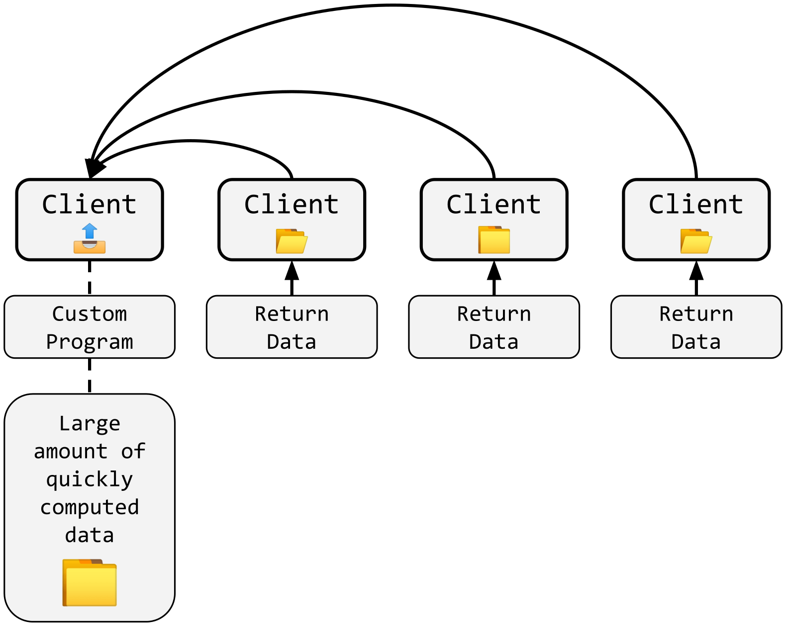

#  Distributed Compute Coin

[![Badge License]][License]   [![Button Discord]][Discord Server]

A unique P2P blockchain built in C++, with a trading client and a miner. This crypto can be bought, traded, sold, mined, or used just like any other. What sets it apart though is how it can be used, and the technique for mining. It is based on sharing mining computing hardware with developers to run their programs better and compute a large amount of data quickly, using Distributed Computing. Anybody can submit code using the client to be run across the peer-to-peer network, and will pay for that using this crypto. [What sets this crypto apart?](./#condensing).

If you want to learn more, please feel free to go to [the wiki.](https://github.com/sam-astro/Distributed-Compute-Coin/wiki)

<hr>

## Installation / Use:
1. First, either clone with `git clone https://github.com/sam-astro/Distributed-Compute-Coin` or download it as a ZIP file, and extract it.
2. All of the builds are packaged in this folder. They all follow the same directory map, and the binary is located at `DCC-Miner/out/DCC-Miner/Debug/DCC-Miner.exe`.
3. A change from the C# version, is that all functionality is now combined into a single program, which can handle transactions, submitting programs, and mining. It is also currently a command-line only interface while in development. 
4. **If you are interested in earning DCC, then you can use the Mining aspect of the client.** The miner verifies the blockchain network, and also run programs created by developers. Just like the developers, programs are written in a language called Rust and you will need to install Rust before using the Miner. You can do that by going to the [Rust website](https://www.rust-lang.org/tools/install) and following the instructions there, which should only take a few minutes. Just use the `--mine` command to start mining a single block. You can also specify how many blocks you want to mine after the command like: `--mine 10` will mine 10 blocks. Using `-1` will mine until you stop the program.
```
Usage: DCC-Miner.exe [options]
		 OR (while in interactive mode)
       Input: [options]
Options:
  -h, --help                          Display this help menu
  -v, --version                       Print the current wallet and block version
  -s, --sync                          Manually re-sync blockchain
  -sb, --syncblock                    Manually re-sync a single block on the blockchain
  -m, --mine <amount>                 Mine <amount> number of blocks, defaults to 1 if not specified
  -ma, --mineany <block num> <dif>    (Debug) Mines the block specified by <block num> at the given 
                                          difficulty <dif>
  --funds                             Count and print the funds of the user
  --difficulty                        Calculate the expected block's difficulty
  -sn, --send <addr> <amount>         Sends the <amount> of DCC to a receiving address <addr>
  -sp, --superblock                   Generates a debug superblock to summarize all transactions
  -vf, --verify                       Verify the entire blockchain to make sure all blocks are valid
  -p, --pool <url>                    Start mining at a pool, given by <url>. Default is
                                          http://dccpool.us.to:3333
```
Inputting one of these commands and pressing the Enter key will execute the command. To begin mining, simply type "mine" (and a block amount, if you want to mine more than one).

<hr>

# The Docker Update
For a much increased ability to compute, better portability, and fine control of the permissions programs are able to exercise, Docker containers will be replacing Rust programs in the near future.

A set of commands for managing task may look like:
```ruby
# Start container with limited network and file access 
docker run --network none --rm --name=<taskID> -v "C:\Program Files\DCC\TaskData\<taskID>:/dcc_output/" <taskIDImg> /bin/bash run.sh;
# Wait for the container to exit and return exit code (This will be done in a background thread, and will time out when mining ends)
docker wait <taskID>;
# Stop the container
docker stop <taskID>;
```

## Computation Buying
Through this update, the uploading process should also be finalized, so as to completely remove the the server that has been passing out and managing programs since the C# implementation.

The new command will be:
```
--buy-computation <funds> <container> [cpu-power] [gpu-power] [memory]     Create a program on the network, and allocate <funds> to be paid to the respective miners.
```
Optionally, the `[cpu-power]` option can specify an integer between 0-10, between lowest cpu power required and max cpu power required. The `[gpu-power]` option is similar. The `[memory]` option is used to specify how much RAM the container has access to in GB. By default, this value is 2 GB.

There will also be a command to verify the readiness of a container before releasing, to ensure it works with the limited file, network, and resource access:
```
--verify-container <container> [cpu-power] [gpu-power] [memory]
```
The above options still apply, so you can test how well they will perform on your own hardware.

## Computation Verification
In order to verify the results of the computation of the container task, a method called Verification by replication, used by SETI@Home, will be used. This will involve a number of miners getting the same task, and their hashes of the computed data will be compared. Once a minimum of them match, the value will be saved.

## URL Address Aliases
There will be added support for OpenAlias, and such URLs as http://dccpool.us.to will get the TXT record, and return `oa1:dcc recipient_address=fd394f214e71e4aaf995914207d44181ca9e92c2f508afadf06d367f06151f84;`

<hr>

# Condensing

The idea of the Distributed Computing Network likely seems a little backwards to begin with. *Why use your computer to run others' programs to save up DCC to run your own, when you can just run it on your own PC?* The answer to this is simple: when you use and run DCC, it is **not** an exchange. Rather, it is a ***condensing*** of your computing power, to be used on-demand at a later date.

Most of the worlds computers run at a capacity far below their maximum, because of *idling*. When you are not running your program, your computer has nothing to do, right? And you only utilize that maximum it can reach sparsely, when you need something more demanding done. So most of the time, the power of your computer goes to waste.

Instead of allowing this to happen, DCC allows you to **condense** this idle computing time (***condensing** is comparable to mining in other cryptocurrencies*), storing it physically in the form of DCC$, and letting you use it at a later time to exhert far more computing power than you could originally utilize, in far lower time.

With this system, each client will receive an amount of DCC$ proportionally to their hardware, and more efficiently utilize hardware world-wide. Imagine an Artificial Intelligence model, that can be trained an equivilant of centuries in a matter of 5 minutes. Or protein folding and other medical computations. Or an accurate simulation of atoms, to a macroscopic scale. Or the simulation of a brain.

Supercomputers are expensive to build, and equally as expensive for institutions to rent. Distributed Supercomputing is far cheaper, and actually contains enough power to out-compete even the best supercomputers. Although it has existed for some time, most implementations are through the process of volunteering, and a centralized developer and goal. DCC will bring supercomputing to the people, for a low price.

<hr>


## Example of block format:
> This is the genesis block
```json
{
    "_version": "v0.8.0-alpha-coin",
    "containerTasks": [
        {
            "taskID": "",
            "taskInstances": [
                {
                    "responsiblePeers": [],
                    "seed": "",
                    "taskDataHash": ""
                }
            ]
        }
    ],
    "hash": "dccba5e885fda6209b50397c3d97ab416da0928d7d49b5f0bc9835cd88f756d6",
    "lastHash": "0000000000000000000000000000000000000000000000000000000000000000",
    "nonce": "1275615",
    "targetDifficulty": "0000000ffff0000000000000000000000000000000000000000000000000000",
    "time": "0",
    "transactionTimes": [
        1664574203
    ],
    "transactions": [
        {
            "sec": {
                "note": "",
                "pubKey": "",
                "signature": ""
            },
            "tx": {
                "amount": 1000000000,
                "fromAddr": "",
                "toAddr": "fd394f214e71e4aaf995914207d44181ca9e92c2f508afadf06d367f06151f84",
                "transactionFee": 0,
                "unlockTime": 0
            }
        }
    ]
}
```

<hr>

## Here is how the system works in 5 simplified steps:

### 1. Announce program to peers, with reward as payment


### 2. Peers download program


### 3. They compute program while they mine


### 4. They send the computed data back to the developer, which is compiled into a large block, computed in a fraction of the time it would normally have taken


<hr>

## Using:
* OpenSSL
* cURL

<!----------------------------------------------------------------------------->

[License]: LICENSE
[Discord Server]: https://discord.gg/9p82dTEdkN


<!----------------------------------[ Badges ]--------------------------------->

[Badge License]: https://img.shields.io/badge/license-DCP--GPL-brightgreen
[Button Discord]: https://img.shields.io/badge/Discord_Server-573f75.svg?style=social&logo=Discord
